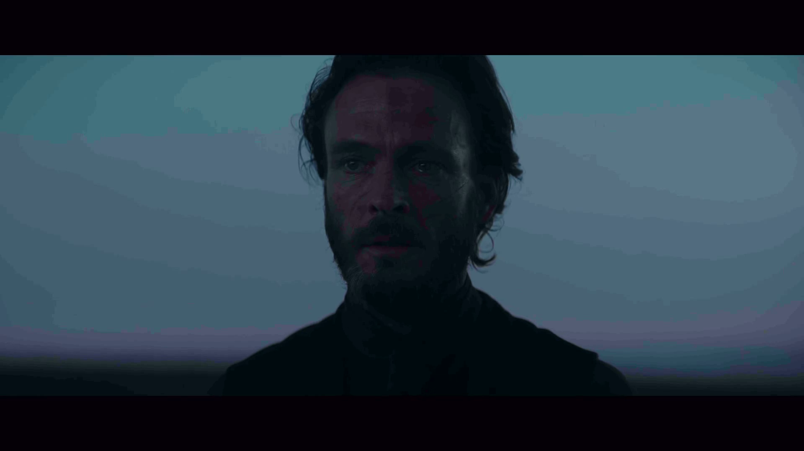
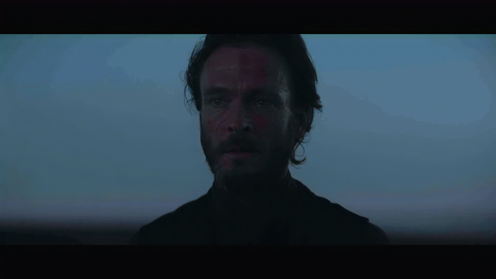
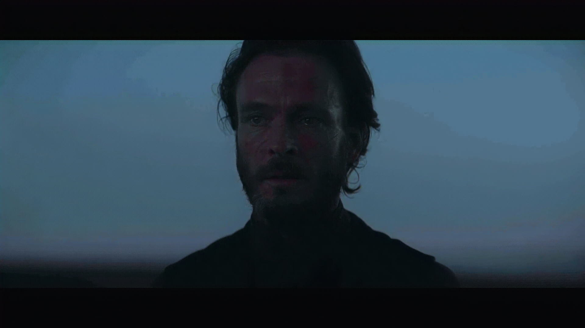
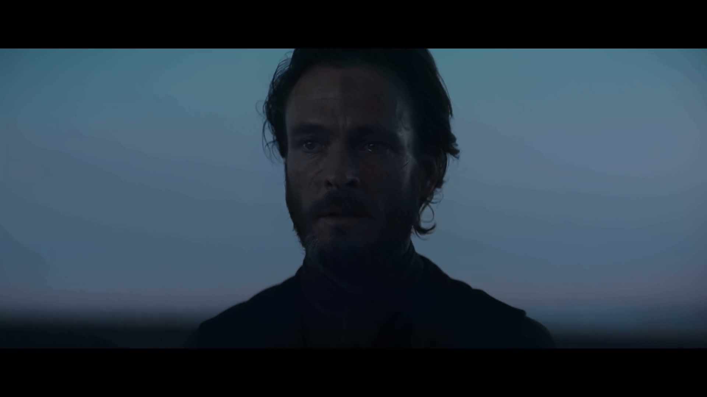
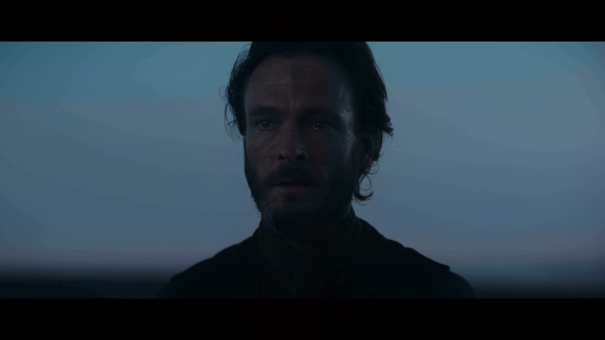
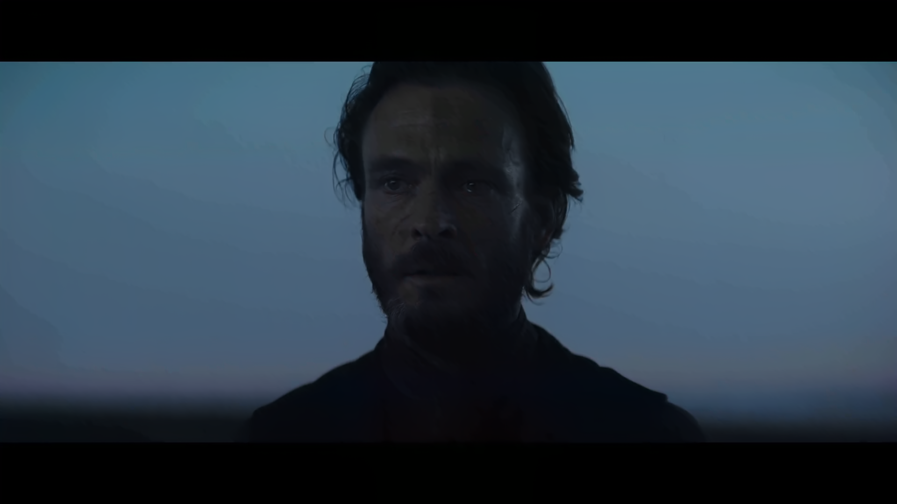

# Guiding WaveMamba with Frequency Maps for Image Debanding
 
[](https://github.com/xinyiW915/Debanding-PCS2025)


Official Code for the following paper:

**X. Wang, S.Tasmoc, N. Anantrasirichai, and A. Katsenou**. [Guiding WaveMamba with Frequency Maps for Image Debanding](https://arxiv.org/abs/)

---
## Performance

### **Quantitative evaluation on the deepDeband test set (patch pairs)**

| Model              | PSNR↑           | SSIM↑           | LPIPS↓         | CAMBI↓          | BBAND↓          | DBI↓          |
|-------------------|-----------------|-----------------|----------------|-----------------|-----------------|---------------|
| Banded Images      | 36.286          | 0.977           | 0.081          | 1.467           | 1.217           | 0.083         |
| FFmpeg             | 31.383          | 0.941           | 0.110          | 0.955           | 0.632           | 0.035         |
| PPP                | 32.432          | 0.927           | 0.188          | 3.619           | 1.230           | **0.005**     |
| DIP                | 34.364          | 0.957           | 0.093          | 1.728           | 0.820           | 0.034         |
| LDM                | 30.597          | 0.905           | 0.140          | 0.824           | 0.853           | 0.057         |
| deepDeband-F       | 34.584          | 0.964           | 0.071          | *<u>0.057</u>*  | **0.464**       | 0.122         |
| deepDeband-F-WWM   | 35.005          | 0.967           | 0.066          | **0.055**       | *<u>0.484</u>*  | 0.104         |
| WaveMamba          | **42.399**      | **0.989**       | 0.037          | 3.947           | 1.410           | *<u>0.021</u>*|
| WaveMamba-WWM      | *<u>42.201</u>* | *<u>0.988</u>*  | **0.033**      | 3.615           | 1.436           | *<u>0.021</u>*|
| WaveMamba-DWT      | 42.111          | *<u>0.988</u>*  | *<u>0.036</u>* | 3.798           | 1.403           | 0.022         |
| WaveMamba-MAP      | 41.546          | *<u>0.988</u>*  | 0.037          | 3.523           | 1.343           | 0.022         |

### **Quantitative evaluation on the HD_Images_DBI dataset (Full HD pairs)**
Which serves as the source for patch extraction in the deepDeband dataset.

| Method           |          PSNR↑ |          SSIM↑ |            LPIPS↓ |         CAMBI↓ |         BBAND↓ | DBI↓          |
|:-----------------|---------------:|---------------:|------------------:|---------------:|---------------:|:--------------|
| Banded Images    |         35.632 |          0.958 |             0.066 |      **0.337** |          0.411 | 0.312         |
| deepDeband-F     |         32.956 |          0.906 |             0.079 |          0.375 | *<u>0.154</u>* | 0.166         |
| deepDeband-F-WWM |         33.237 | *<u>0.907</u>* |             0.078 | *<u>0.374</u>* |      **0.153** | 0.168         |
| WaveMamba        |*<u>39.037</u>* |      **0.977** |             0.046 |          0.543 |          0.386 | 0.133         |
| WaveMamba-WWM    |     **39.339** |      **0.977** |         **0.044** |          0.525 |          0.398 | 0.139         |
| WaveMamba-DWT    |          38.97 |      **0.977** |    *<u>0.045</u>* |          0.616 |          0.412 | *<u>0.128</u>*|
| WaveMamba-MAP    |         38.826 |      **0.977** |             0.048 |          0.519 |          0.365 | **0.082**     |

### **Cross-dataset evaluation on BAND-2k dataset, using models trained on deepDeband**

| Model             | PSNR↑            | SSIM↑          | LPIPS↓         | CAMBI↓         | BBAND↓         | DBI↓          |
|------------------|------------------|----------------|----------------|----------------|----------------|---------------|
| Banded Images     | 37.344           | 0.964          | 0.100          | **0.513**      | 0.564          | 0.431         |
| deepDeband-F      | 33.130           | 0.897          | 0.116          | 0.561          | **0.198**      | 0.225         |
| deepDeband-F-WWM  | 33.263           | 0.898          | 0.115          | *<u>0.557</u>* | **0.198**      | 0.227         |
| WaveMamba         | 38.926           | **0.977**      | 0.063          | 0.647          | 0.519          | *<u>0.148</u>* |
| WaveMamba-WWM     | **39.054**       | **0.977**      | **0.059**      | 0.639          | 0.541          | 0.157         |
| WaveMamba-DWT     | *<u>38.963</u>*  | **0.977**      | *<u>0.062</u>* | 0.702          | 0.551          | 0.158         |
| WaveMamba-MAP     | 38.505           | *<u>0.976</u>* | 0.066          | 0.691          | *<u>0.476</u>* | **0.082**     |

Best and second-best results are highlighted in bold and *italic underline*, respectively. Arrows indicate if higher or lower values are preferred.

See [`stat_metric.ipynb`](./src/stat_metric.ipynb) for a comprehensive performance comparison and detailed statistical results.

## Visual Inspection

### Visual comparison of debanding performance during inference on the BAND-2k dataset 
<p align="center">
  
</p>

### Qualitative comparisons of the models trained and tested on deepDeband patches
<p align="center">
  
</p>

<h3>Full HD visual comparison of debanding results on a difficult case</h3>
<p>More visual examples can be found in the <a href="./test_img">test_img</a> folder.</p>

<table style="margin:auto;">
  <tr>
    <td align="center">
      <br>Banded
    </td>
    <td align="center">
      <br>deepDeband-f
    </td>
    <td align="center">
      <br>deepDeband-f-WWM
    </td>
    <td align="center">
      <br>WaveMamba
    </td>
  </tr>
  <tr>
    <td align="center">
      <br>WaveMamba-WWM
    </td>
    <td align="center">
      <br>WaveMamba-DWT
    </td>
    <td align="center">
      <br>WaveMamba-MAP
    </td>
    <td align="center">
      <br>Pristine
    </td>
  </tr>
</table>

## Usage

### 📥 Download Banding Datasets
The corresponding bading image datasets can be downloaded from the following sources:  
[deepDeband](https://github.com/RaymondLZhou/deepDeband), [HD_images_dataset_dbi](https://github.com/akshay-kap/Meng-699-Image-Banding-detection), [BAND-2k](https://github.com/zijianchen98/BAND-2k?tab=readme-ov-file).  

### 🔧 WaveMamba with Frequency Maps

To implement the following variants, please refer to the README.md in [`WaveMamba-Frequency-Masking`](./WaveMamba-Frequency-Masking/README.md): 
1. [`WaveMamba-WWM`](./WaveMamba-Frequency-Masking/ckpt/net_g_latest_WaveMamba.pth), 2. [`WaveMamba-DWT`](./WaveMamba-Frequency-Masking/ckpt/net_g_latest_WaveMamba_dwt.pth), 3. [`WaveMamba-MAP`](./WaveMamba-Frequency-Masking/ckpt/net_g_latest_WaveMamba_map.pth)

### 📈 Evaluation Metrics

We evaluate performance using the following metrics: **PSNR, SSIM, LPIPS, CAMBI, BBAND, DBI**.

Run the following script to compute quality metrics and statistical results:

```bash
python src/cal_metrics.py
python src/cal_stat.py
```

We include computed **BBAND** and **DBI** scores are included in: [`src/BBAND/`](./src/BBAND) and [`src/DBI/`](./src/DBI/DBI_score_results). For details on **DBI** metric training and computation, please refer to the original [DBI GitHub repository](https://github.com/akshay-kap/Meng-699-Image-Banding-detection).

## Acknowledgements

Based on [BasicSR](https://github.com/XPixelGroup/BasicSR) and [Wave-Mamba](https://github.com/AlexZou14/Wave-Mamba) framework.

## Citation
If you find this paper and the repo useful, please cite our paper 😊:
```bibtex
@article{wang2025wavemamba-frequency-map,
  title={Guiding WaveMamba with Frequency Maps for Image Debanding},
  author={Wang, Xinyi and Tasmoc, Smaranda and Anantrasirichai, Nantheera and Katsenou, Angeliki},
  year={2025},
}
```

## Contact:
Xinyi WANG, 
xinyi.wang@bristol.ac.uk
